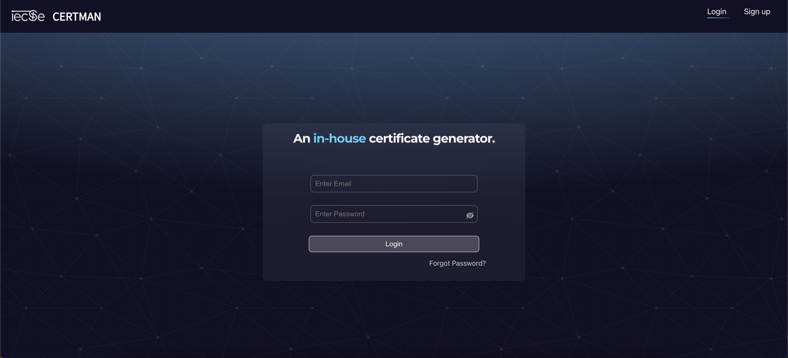
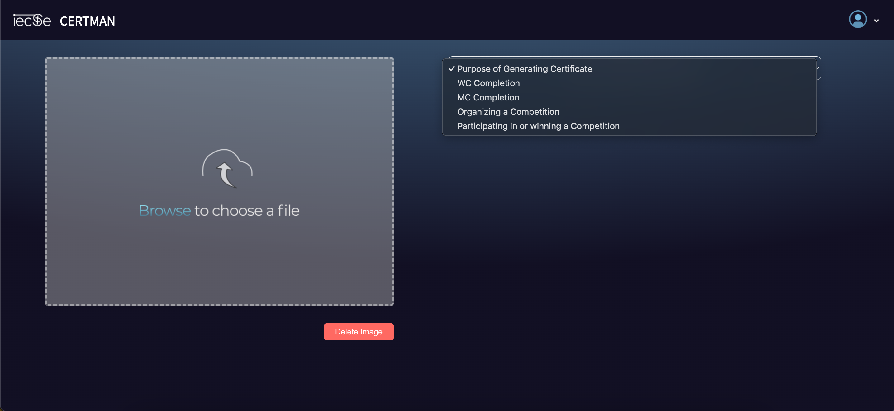
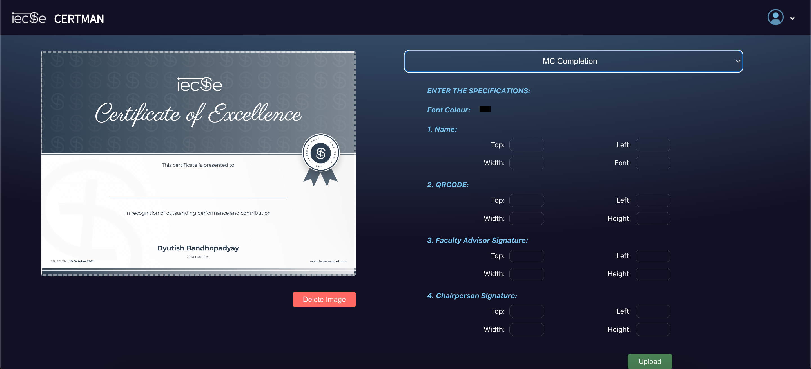

# Certman-IECSE

Certman is an in-house certificate generator designed to streamline the process of creating and distributing certificates for various purposes. Created as part of IECSE Manipal, the official Computer Science Club of Manipal Institute of Technology.

## Features

- **Multiple Certificate Types**: Choose from various types of certificates such as completion, participation, and awards.
- **Customization**: Easily adjust fonts, colors, and placement of text to suit your specific needs.
- **User-Friendly Interface**: Intuitive design for hassle-free navigation and certificate creation.
- **Secure Login System**: Ensures that only authorized users can create and manage certificates.

## Glimpse of the Application







## Getting Started

To get a local copy up and running, follow these simple steps.

### Prerequisites

Before you begin, ensure you have the following installed:
- Node.js
- npm
```bash
npm install npm@latest -g


## Installation

### Clone the repository

```
git clone https://github.com/shourya2002-geek/Certman-IECSE.git


### Navigate to the project directory

```
cd Certman-IECSE


### Install NPM packages

```
npm install


### Start the application

```
npm start
```

## Usage

To use Certman, follow these steps:

1. Login/Sign Up: Securely login or sign up to access the certificate generator.
2. Select Certificate Type: Choose the type of certificate you wish to generate.
3. Customize: Use the editor to customize the certificate with names, dates, and other relevant information.
4. Preview & Generate: Preview your certificate and generate a PDF or print-ready version. You can email the certificates as well.

## Contributing

Contributions are what make the open-source community such an amazing place to learn, inspire, and create. Any contributions you make are greatly appreciated.
