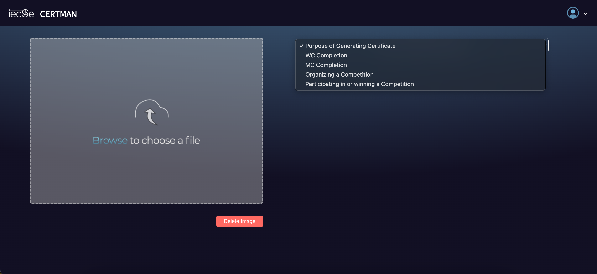
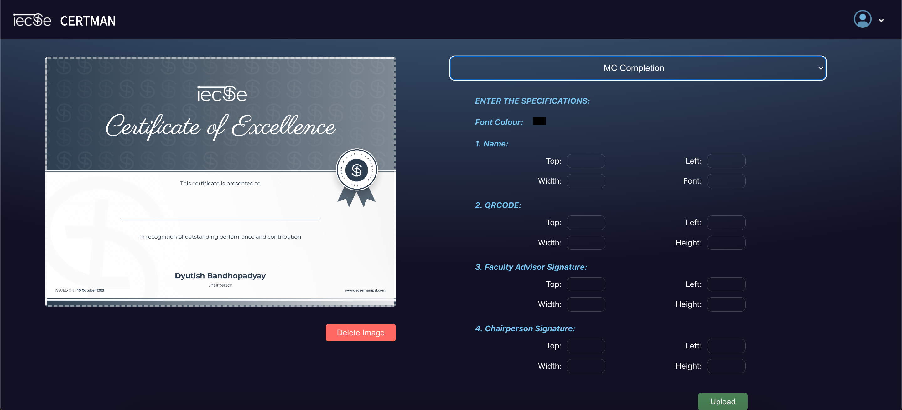
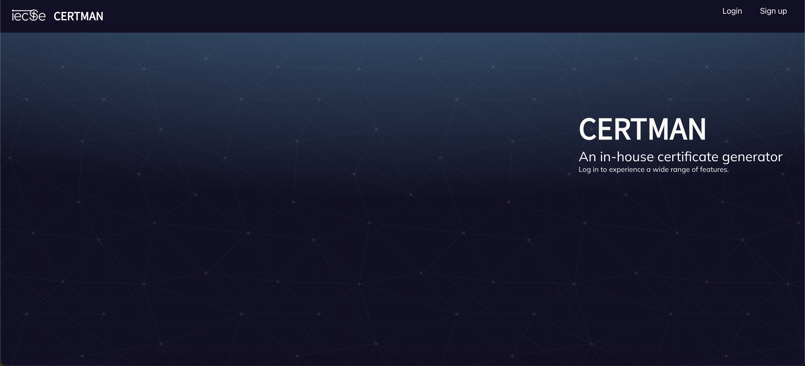
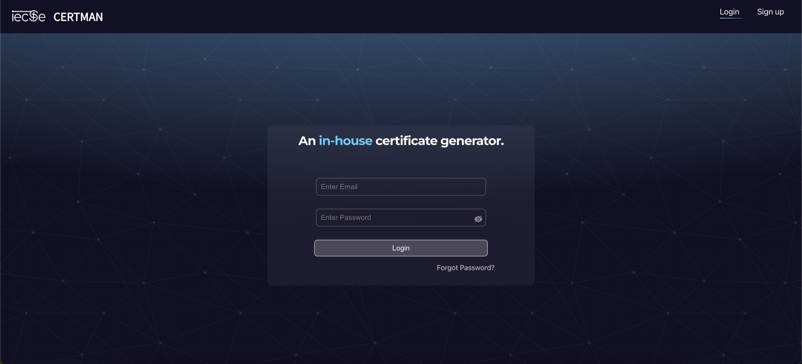

# Certman-IECSE

Certman is an in-house certificate generator designed to streamline the process of creating and distributing certificates for various purposes. Created as part of IECSE Manipal, the official Computer Science Club of Manipal Institute of Technology.

## Features

- **Multiple Certificate Types**: Choose from various types of certificates such as completion, participation, and awards.
- **Customization**: Easily adjust fonts, colors, and placement of text to suit your specific needs.
- **User-Friendly Interface**: Intuitive design for hassle-free navigation and certificate creation.
- **Secure Login System**: Ensures that only authorized users can create and manage certificates.

## Glimpse of the Application






## Getting Started

These instructions will get you a copy of the project up and running on your local machine for development and testing purposes.

### Prerequisites

What things you need to install the software and how to install them.

```bash
give examples
